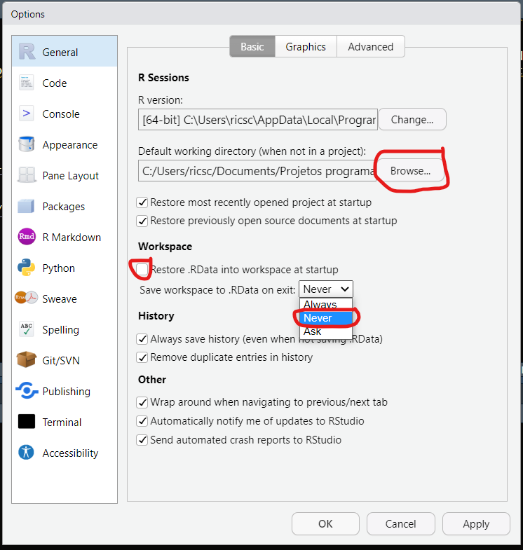
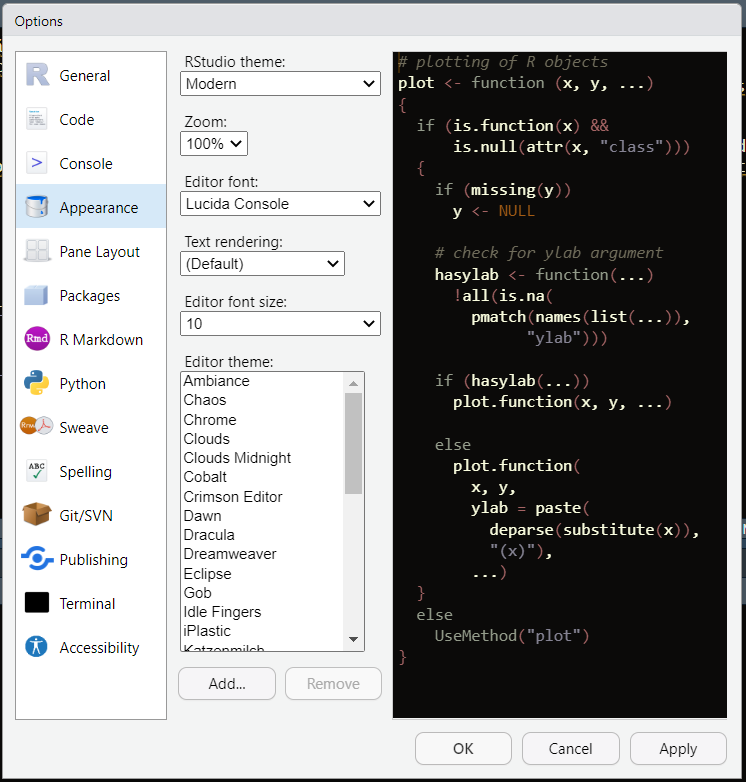

# Introdução {#introduction}

## História

R é "uma linguagem de programação e um ambiente para computação estatística e gráfica". Ela criada em 1993 por Ross Ihaka e Robert Gentleman da Universidade de Auckland, Nova Zelândia, com o apoio de John Chambers da Bell Laboratories. Foi inspirada na linguagem S, e por ser sua sucessora (e pela inicial dos autores), recebeu o nome R. Não, infelizmente, não é R de "Ricardo".

"Ambiente" no sentido de que é uma linguagem de programação formal, um "sistema totalmente planejado e coerente". Mas ainda assim, sendo especializada, com ferramentas poderosas e acessíveis para computação e visualização de projetos estatísticos ou da ciência de dados. Ao mesmo tempo, é facilmente incrementável, com centenas de extensões para as mais diversas áreas.

Entidades associadas ao desenvolvimento da linguagem:

- O [Comprehensive R Archive Network](https://cran.r-project.org/) (CRAN) foi criado em 1997 por Kurt Hornik e Fritz Leisch para armazenar o código fonte, documentação, e pacotes do R.
- O [R Core Team](https://www.r-project.org/contributors.html) foi formado em 1997 para desenvolver a linguagem
- A linguagem como projeto e homepage oficial é o [R Project](https://www.r-project.org/). Também existe a [homepage](https://stat.ethz.ch/R-manual/) das versões em desenvolvimento do R.
- A [R Foundation](https://www.r-project.org/foundation/) foi fundada em 2003 para guiar o R Project.
- O RStudio, agora [Posit](https://posit.co/about/) foi fundado para expandir a qualidade do projeto, lançando um ambiente de desenvolvimento integrado em 2011, e oferecendo soluções para empresas.
- O [R Journal](https://journal.r-project.org/) e [R Blog](https://blog.r-project.org/).


## Características da Linguagem, e "Porque R?"

O R é uma linguagem bem específica. Abaixo cito algumas de suas características, e porque elas podem motivar seu estudo.

- R está disponível como código aberto, com sua licença [GNU General Public License](https://www.r-project.org/COPYING). Adicionalmente, é acessível para a maioria das máquinas/sistemas operacionais. Isso faz com que projetos no R sejam facilmente replicados por outros, e aumenta sua popularidade.

- R é uma linguagem popular, ficou na posição 21 no [TIOBE Index](https://www.tiobe.com/tiobe-index/) em fev/2024. Especialmente, ele conta com uma comunidade muito ativa e amigável, na [#rstats](https://twitter.com/search?q=%23rstats) do Twitter, no [StackOverflow](https://stackoverflow.com/questions/tagged/r), no [Posit Community](https://community.rstudio.com/), e [pessoalmente](https://www.meetup.com/topics/r-programming-language/).

- Um produto dessa popularidade é a quantidade massiva de extensões, para toda sorte de tarefa.
  - Existem múltiplas abordagens para manipulação de dados, modelagem, e criação de visualizações.
  - Poderosas ferramentas para comunicação, o RMarkdown (que foi utilizado para construir esse livro), e o Shiny, utilizado para construir Apps.
  - Ferramentas na fronteira de pesquisa, uma vez que pesquisadores costumam criar pacotes no R para acompanhar sua pesquisa.
  
- Ocupa um espaço muito interessante na paisagem de softwares:
  - É uma linguagem de programação verdadeira, permitindo soluções para problemas mais complexos, e dando mais flexibilidade ao usuário, quando comparado com outros softwares estatísticos não programáticos como o SAS, SPSS, Stata, Eviews, e GRETL.
  - Mas é especializado, _interpretada_, e _high-level_, facilitando seu uso, e apresentando uma cuva de aprendizado mais rápida que linguagens mais complexas/generalistas como C, e talvez Python. <br>
- A especialização em estatística faz com que ferramentas muito necessárias para análise de dados sejam de fácil acesso, como _data-frames_ e _vetorização_. O usuário não precisa aprender extensões para realizar projetos em ciência de dados.

- Algumas características mais técnicas:
  - Sua sintaxe é similar à C e Python, mas sua semântica é a de uma linguagem funcional, mais similar à Lisp e APL. Veremos que o estilo funcional é muito útil para projetos de ciência de dados.
  - Além das funcionais, R tem capacidades incomuns de metaprogramação, permitindo códigos elegantes e sucintos.
  - Não é seu forte, mas também conta com algumas ferramentas de programação orientada ao objeto, facilitando a vida do usuário.
  - O R usa código em C, C++, e Fortran para executar tarefas computacionalmente intensivas. Isso é algo que o usuário também pode explorar.

Porém, nem tudo são flores. Muitas dessas características tem prós e contras, e a execução dessas ideias conta com heranças obsoletas e inconsistências. Neste livro, deixarei claro os pontos negativos mais importantes, e ensino a evitá-los.


## Literatura sobre R {#biblio}

A literatura base pode ser encontrada no [CRAN](https://cran.r-project.org/manuals.html). Ela é composta de, principalmente:

- O código fonte [@r-source].
- O manual "R Language Definition" [@r-lang], que descreve a linguagem em si.
- O manual "R Internals" [@r-int], que descreve as estruturas internas do R, e a fundação do código em C.
- A documentação de ajuda para o R base e as extensões padrões [@r-helps].
- A documentação de ajuda para as extensões externas [@r-packs].

Nenhuma dessas é exatamente didática, mas existe uma vasta bibliografia de livros para R, tanto para ensinar a linguagem no geral, quanto para toda sorte de aplicações. Abaixo alguns exemplos mais recentes, divididos pela sua relação com cada parte deste livro.

**Bibliografia base da parte I:** o livro "Advanced R" (segunda edição) [@advr], junto com "R Language Definition".

- Outros livros introdutórios:
  - "An Introduction to R" [@r-intro] (manual oficial).
  - "Working with R" [@workr].
  - "An Introduction to R" [@intror].
- Livro complementar, com abordagem "aprender fazendo": "Hands on Programming with R" [@hopr]
  
**Bibliografia base da parte II:** o livro "R for Data Science" [@r4ds] e as documentações dos pacotes do tidyverse [@tidy].

- Outros livros sobre manipulação e visualização de dados:
  - "Data Manipulation in R" [@mandata].
  - "ggplot2: Elegant Graphics for Data Analysis" [@ggplot].
  - "Data Wrangling Recipes in R" [@wrandata].
- Livro complementar, com abordagem "aprender fazendo": "Introduction to Data Exploration and Analysis with R" [@introdata].

**Bibliografia base da parte III:** o livro "R Cookbook" (segunda edição) [@advr], e o livro "Big Book of R" [@bigr].

- Existem muitos outros livros e tutoriais dedicados a aplicações específicas. Algumas listas (incompletas) podem ser encontradas no [arquivo do CRAN](https://www.r-project.org/doc/bib/R-jabref.html).


## Estilo do Livro

Antes de prosseguir, quero expor de antemão o estilo e organização dos capítulos.

Este livro tem muito a cobrir, e tem um andamento acelerado. Para facilitar ao máximo a vida do leitor, o estilo dos capítulos foi definido para ajudar a direcionar a atenção para o que é mais importante, e menos atenção para o extra. Abaixo apresento alguns dos construtos utilizados para tal.

Pequenos excertos de código são apresentados na linha `1 + 1`{.r}, e blocos de código como abaixo.


```r
x <- 1 + 1
x*2
```


:::{.result}
**"Nome" do resultado**<br>
Resultados importantes são expostos neste tipo de bloco. Note que nem todos os resultados serão simples de entender imediatamente, mas são expostos no momento em que é relevante para o estudo da linguagem.
:::

**Palavras em negrito:** normalmente indicam conceitos que serão definidos. Após sua apresentação, os conceitos costumam deixar de aparecer em negrito.

_Palavras em itálico_ costumam ser palavras com utilizadas com um significado específico no contexto relevante, mas não necessariamente "conceitos". Em contrapartida, as vezes uso aspas para indicar uma palavra sendo utilizada pelo seu significado em português, e não como um conceito da programação. Porém, cuidado, as vezes aspas tem seu uso padrão, e itálico é usado para palavras em inglês.

:::{.ex}
as vezes é importante apresentar um exemplo para esclarecer um conceito. Tendo a colocar exemplos apenas quando necessário, de modo que é importante entendê-los. Em contrapartida, não há muitos exemplos "complementares". É natural que essa baixa frequência torne difícil a compreensão de alguns temas. Mas para isso existem os exercícios.
:::

:::{.warn}
nesse bloco explicito coisas que o leitor deve prestar atenção. Na maioria dos casos, apresento causas comuns de erros.
:::

:::{.obs}
observações deste tipo costumam ser sobre a organização do livro ou outros esclarecimentos menos importantes.
:::

:::{.extra}
nesse tipo de bloco apresento referências que tratam do tema relevante com mais calma, ou trazem tópicos adicionais para o leitor que queira expandir seus conhecimentos.
:::

Ao final de cada capítulo existe uma seção de "Complemento". Nele, há:

- Uma recapitulação dos conceitos apresentados.
- Uma lista de exercícios, que pode, inclusive, apresentar novos conceitos/funções.
- Uma lista de funções apresentadas no capítulo.
- Uma seção de referências, inclusive com links para conceitos deixados de lado no capítulo, para o leitor que quiser ir além.


## Instalação, Interface, e Ferramentas

Antes de começar o aprendizado, é preciso instalar a linguagem (R), e se familiarizar com a interface do editor de código oficial (RStudio).

Veja como instalar [neste tutorial](https://www.curso-de-programacao-em-r-para-jornalistas.com/2019/10/27/instalacao-r-e-rstudio/) do curso "R Para Jornalistas". PS: coincidentemente, a maneira que jornalistas instalam o R serve para qualquer outra profissão também.

Existem vários tutoriais online explicando a interface, como o da [Datacamp](https://www.datacamp.com/tutorial/r-studio-tutorial) (veja até "How to Write R Scripts in RStudio") e este no video ["RStudio for the Total Beginner"](https://www.youtube.com/watch?v=FIrsOBy5k58).

Além disso, existem três configurações mais comuns de serem alteradas: alterar onde os arquivos são salvos por padrão (figura 1, "browse"); impedir que os dados da última vez que você entrou no R sejam recarregados quando você voltar (figura 1, "workspace"); e alterar aparência (figura 2). Todas elas podem ser encontradas na tab _Tools > Global Options_:

{width=300px} {width=300px}

:::{.extra}
vide [@workr], capítulo "3 - Using RStudio", e/ou [@cookr], [3 - "Navigating the Software"](https://rc2e.com/navigatingthesoftware), para mais informações sobre a interface.
:::

Até o momento, eu fui preguiçoso e não trouxe esse material para o livro. Ainda assim, veja as referências com calma, não deixe confusões com o software atrapalharem seu aprendizado.

Última coisa, eu juro. O R provê alguns comandos para procurar por ajuda. A função `vignette()` abre uma lista de artigos de ajuda das extensões do R. Adicionalmente, se você quer saber informações sobre uma função chamada "acaba_pelo_amor_de_deus", os códigos abaixo abrem suas documentações de ajuda. Vejam mais sobre [aqui](https://stat.ethz.ch/R-manual/R-devel/library/utils/html/vignette.html), e [aqui](https://stat.ethz.ch/R-manual/R-devel/library/utils/html/help.html).


```r
?acaba_pelo_amor_de_deus
help("acaba_pelo_amor_de_deus")
```

Agora sim, vamos começar. **Boa sorte!**
